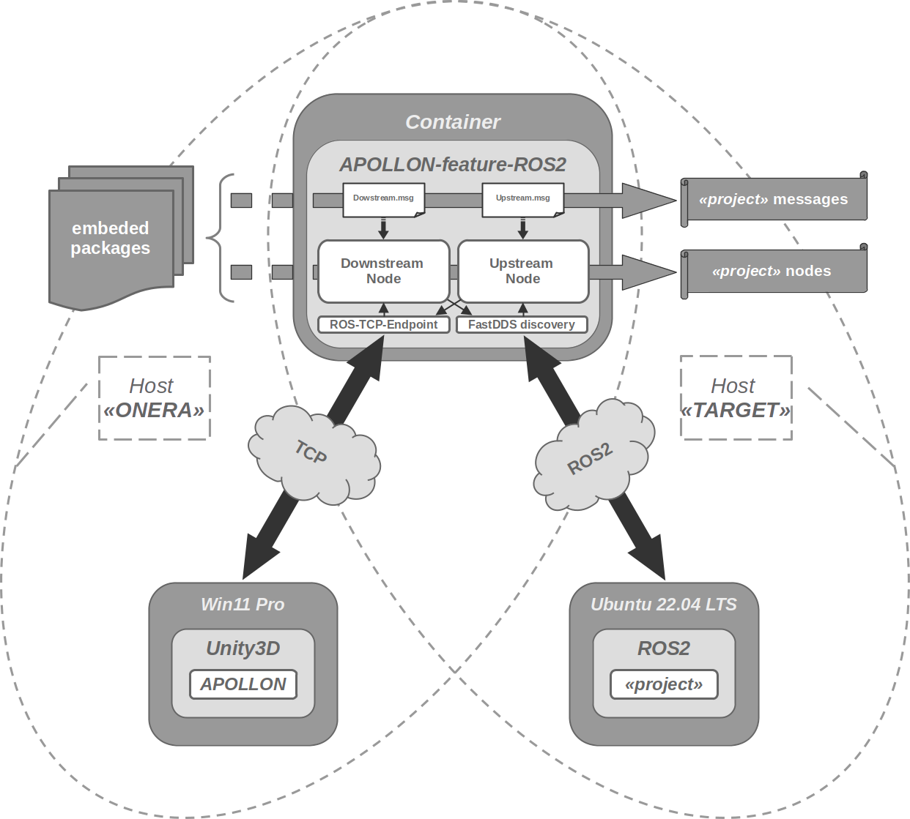

# APOLLON-feature-ROS2

inspired from [this integration](https://github.com/Unity-Technologies/Unity-Robotics-Hub/blob/v0.7.0/tutorials/ros_unity_integration/README.md) & more specifically, [about the ROS2 environment](https://github.com/Unity-Technologies/Unity-Robotics-Hub/blob/v0.7.0/tutorials/ros_unity_integration/setup.md#-ros2-environment)

## Architecture

## Project

- [LEXIKHUM-OAT Gateway](./project/lexikhum-oat/README.md)