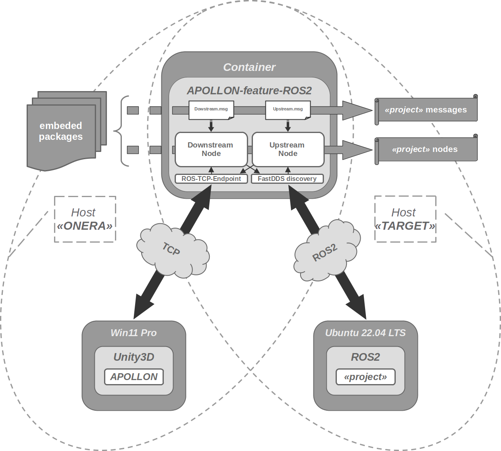

# APOLLON-feature-ROS2

inspired from https://github.com/Unity-Technologies/Unity-Robotics-Hub/blob/v0.7.0/tutorials/ros_unity_integration/README.md

## Architecture



## Build the container 

### Podman :=) 

https://podman.io/ 

```bash
podman build -t apollon-isir-humble:0.0.1 -f docker/ISIR/Dockerfile .
podman network create -d host apollon-net
podman run -it --rm -p 10000:10000 -p 11311:11311 -p 11811:11811 apollon-isir-humble:0.0.1 /bin/bash
```

> see [here](https://github.com/containers) or [there](https://opencontainers.org/) for more info about the open containers initiative.

### Docker :=(
    
https://www.docker.com/

```bash
docker build -t apollon-isir-humble:0.0.1 -f docker/ISIR/Dockerfile .
docker network create -d host apollon-net
docker run -it --rm --network=apollon-net -p 10000:10000 -p 11311:11311 -p 11811:11811 apollon-isir-humble:0.0.1 /bin/bash
```

## Launch ROS2 endpoint in the container 

usually, the container is deployed on the ISIR "ROS2" Host, so :

- [server-ip]   = 0.0.0.0 
- [server-port] = 11811

> for more informations abour ROS2 & the FastDDS discovery service, see [here](https://fast-dds.docs.eprosima.com/en/latest/fastdds/ros2/discovery_server/ros2_discovery_server.html) or [there](https://fast-dds.docs.eprosima.com/en/latest/fastdds/discovery/discovery_server.html)

```bash
export ROS_DISCOVERY_SERVER="<server-ip>:<server-port>"
fastdds discovery -i 0 &
ros2 launch lexikhum_oat_gateway lexikhum_oat_gateway_container_launch.py
```
